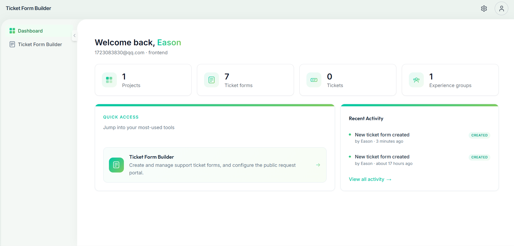
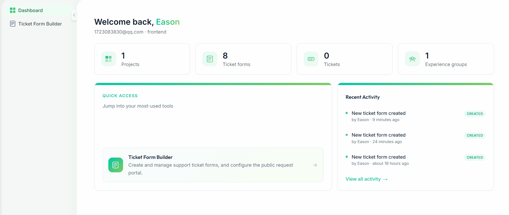

# Ticket Form Builder

A full-stack customer support platform where admins design drag-and-drop ticket submission forms and manage incoming tickets, while customers submit requests through a public, no-login-required portal.

## Features

- **Drag-and-drop ticket form builder** — admins compose custom fields, scope forms to a project, and assign them to experience groups/support channels
- **Public customer portal** — customers submit and track ticket requests against a published form, no account required
- **Ticket management** — queues, SLA policies with breach detection, claim/reply/resolve workflow, and agent conversations
- **Organizations & projects** — multi-tenant structure with role-based access control (RBAC) and team invitations
- **Authentication** — email/password (JWT) and "Sign in with Google" OAuth
- **Real-time ticket chat** — WebSocket-based updates via Django Channels
- **Dashboard** — at-a-glance summary of tickets, forms, and activity

## Demo

- Homepage: 
- Walkthrough: 
- Live site: [ticket-form-builder.vercel.app](https://ticket-form-builder.vercel.app)

## Tech Stack

- **Frontend:** Next.js 14 (App Router), React 18, TypeScript, Tailwind CSS, Radix UI, TanStack Query, Zustand, dnd-kit
- **Backend:** Django 4.2, Django REST Framework, Django Channels, Gunicorn
- **Database:** PostgreSQL (SQLite for local dev with zero config)
- **Authentication:** JWT (`djangorestframework-simplejwt`) + Google OAuth 2.0
- **Deployment:** Vercel (frontend), Render (backend + managed Postgres), Docker Compose (local/self-hosted)

## Installation

### Prerequisites

- Python 3.11+
- Node.js 20+
- Docker (optional, for the one-command setup)

### Option 1 — Docker (recommended, no local Python/Node setup)

```bash
git clone https://github.com/EasonQi777/ticket-form-builder.git
cd ticket-form-builder
docker compose up --build
```

- Frontend: `http://localhost:3000`
- Backend: `http://localhost:8000`
- Postgres: `localhost:5432`

Create an admin user once the stack is up:

```bash
docker compose exec backend python manage.py createsuperuser
```

### Option 2 — Manual setup

**Backend**

```bash
cd backend
python -m venv venv
venv\Scripts\activate            # Windows
# source venv/bin/activate       # macOS/Linux

pip install -r requirements.txt
copy .env.example .env           # Windows; `cp` on macOS/Linux — defaults work out of the box
python manage.py migrate
python manage.py createsuperuser
python manage.py runserver
```

Runs against a local `db.sqlite3` file with zero config — no Postgres required for local dev. See `backend/.env.example` for every variable it reads.

**Frontend**

```bash
cd frontend
npm install
copy .env.local.example .env.local   # Windows; `cp` on macOS/Linux
npm run dev
```

Serves on `http://localhost:3000` and talks to the backend via `NEXT_PUBLIC_API_URL` (defaults to `http://localhost:8000`).

### First run

1. Register an account at `/register` (or log in at `/login`).
2. Create/select a project at `/select-project` (registering auto-creates an organization for you).
3. Build a form under **Ticket Form Builder** (`/admin/ticket-forms`).
4. Create an **Experience Group** at `/admin/experience-groups`, assign the form to it, and publish — its preview page is the public request-form URL customers submit against.

## Roadmap

**Team members on experience groups + multi-project assignment**

Today an `ExperienceGroup` belongs to exactly one project and has no member list of its own — only org/project members (via `ProjectMember`) can manage it. The next milestone opens experience groups up to a wider team and lets admins staff the same person across several projects at once:

- **Invite users directly into an experience group** — extend the existing invitation flow (`ProjectInvitation`) with an experience-group-scoped invite, so an admin can bring in agents/reviewers who only need access to a specific group's forms and tickets, not the whole project.
- **Experience group membership & roles** — a new `ExperienceGroupMember` model (mirroring `ProjectMember`) tracking who's in a group and what they can do there (e.g. viewer, agent, manager), reusing the existing RBAC `Role`/`Permission` scaffolding in `access_control`.
- **Admin: assign members to one or multiple projects** — an admin-facing screen to add an invited/existing user as a `ProjectMember` across several projects in one action, instead of inviting them separately per project.
- **Cross-project view for members** — once a user belongs to multiple projects, the dashboard and project switcher need to reflect that (list all their projects, not assume one).
- **Permission checks updated end-to-end** — `AuthorizationMiddleware` and ticket/form endpoints need to recognize experience-group-level membership, not just project-level, when deciding access.

This is planned, not yet built — tracked here so scope and design decisions (schema for the new membership model, invite email flow, UI for multi-project assignment) stay visible as it's implemented.
